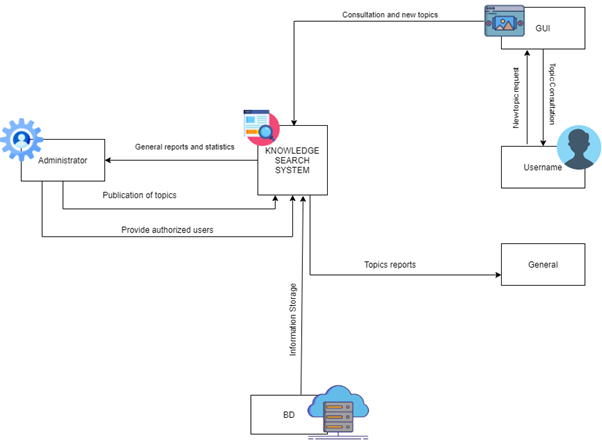

# Introduction

## :trophy: A0.1 Learning Activity

## Objectives

Create the case study context, as well as the field interview, and finally consolidate the information of the requirements, using the empathize phase proposed for design thinking.

### :blue_book: Instructions

- Based on the provided information from the advisor about the design thinking empathize phase, elaborate the indicated activity within the development section. Do a brief investigation about **tools for information collection for client requirements analysis** if needed.
- Every activity or challenge must be done using the **MarkDown style with .md extension** and the VSCode development environment, being elaborated as a **single page** document. This means, if the document hosts images, links or any external file, it must be accessed through tags and links, and must be named with the nomenclature  **A0.1_NombredelaActividad_NombreAlumno.pdf.**
- A tag link in the .md file redirecting to the GitHub repository of the document is required. For instance, **Link to my GitHub**, and must be uploaded once the challenge is concluded.
- From the **.md** file, export a **.pdf** file, which must be uploaded to Classroom inside the corresponding section, serving as work done evidence. Since Classroom is the **official** platform, activity score will be received here.
- Considering that .pdf file was obtained from the .md file, both files must be similar.
- Your repository, in addition of having to contain a **readme**.md file inside the root directory, including the information such as student data, teamwork, subject, career, advisor information, and even logotypes or images, it must have a content section or index, which are actually **links redirecting to your .md documents**. Avoid using text to indicate internal or external links.
- A structure as indicated below is proposed, although any other useful for organizing your repository can be used.

```
| readme.md
| | blog
| | | Cx.1_NombredelaActividad.md
| | | Ax.1_NombredelaActividad.md
| | diagrams
| | docs
| | html
| | img
| | pdf    
```

___

## :pencil2:  Development
A. Taking as a basis the characteristics referred to in the case study and the design thinking proposal, elaborate context, a list of at least **15 questions directed to the client**, such that they can give more detailed information to elaborate the analysis of the requirements on the case study.
1. What would you expect from a knowledge search platform?
*A platform where you can find different related topics from the company I am working with resources such as tutorials.*

2. What sector of the market would you like the application to be focused on?
*Electronic company.*

3. What type of devices will it be convenient for the application to be oriented? (web, mobile, desktop, etc.)
*Web preferably, that you can access it from any kind of device such as a smartphone, computer, tablet, etc.*

4. What functions do you consider essential for the application? 
*Security of the information, ease to share knowledge, that it can be accessed at any time.*

5. What categories will be found within the application? (topics)
*Any type of topic depending on the different departments inside the company oriented on teaching the employees how to do different activities.*

6. Where do you want the most popular topics to be placed?
*I would like to see those with the highest value at the beginning of the application.*

7. What design elements would be appealing for application (colors, fonts, styles)?
*Company related, the most representative colors are blue and white.*

8. What styles represent the company? *(formal, informal, etc.)
formal (minimalist).* 

9. Which users will have the permissions to create topics? (all users, some specific)
*Ranked by access levels on the different departments and the employees making the topics.*

10. What is the user profile that you want the platform to use?
*Users  with very basic knowledge up to an engineer or higher.*

11. If you have one, what kind of reward system would you like to implement for featured users? *(awards, recognitions, etc.)
No reward system.*

12. What long-term results do you expect the platform to have?
*That knowledge can be acquired quickly and easily.*

13. What kind of material is used for the topics? 
*Recorded videos and PowerPoint presentations.*

14. What are security methods for user authentication that you would like to have? 
*You can access your account with alternative emails.* 

15. Should the topics be divided?
*They should be divided by the level of complexity and should be mentioned in the topic (technical, specialized, operational).*

___
B. Once the interview indicated in the previous point has been carried out, use any of the techniques that are proposed within the empathize phase of design thinking, and you can even use any other tool, technique or artifact to consolidate the information collected through the client and elaborate your **proposal for the business model of the system to be developed**.
*Requirements list*
-Topics for an electric company 
-Access through web from any device 
-Priority to security 
-Ease of access and use 
-Ranked by popularity 
-Formal colors (blue and white) 
-Minimalistic design 
-Include media on topics such as recorded videos or PowerPoint presentations

*Context diagram*



*Information consolidation*

The method that is going to be used is the What, how, why method. 

|*What (what are you doing?)*|*How (How are you doing it)*|*Why (Why are you doing it)*|
|----------------------------|----------------------------|----------------------------|
|An easy-to-access platform.|By Using simple design and frameworks that help us work more organized.|To generate a friendly platform.|
|A system that adapts to the company needs.|Through an API.|Use the resources that the company already has.|
|A minimalist interface.|Using formal business colors such as blue and white.|To represent the company's image.|
|Topics related to the electronic area.|Assigning workers from different departments of the company to generate topics.|The company is oriented to the electronic area.|
|Not allowing user creation in the platform.|Using the company’s internal information to generate users for the employees.|To allow company workers access without CRUD and avoid unauthorized registered users.|
|A shared knowledge site.|Using a data manager that stores information.|Users need to find answers to their questions.|
|Present representative information on each topic being pursued.|Showing the title, date of publication and rating of topics in relation to what the user is looking for.|Facilitates the search and access to the topics.|
___
C. Prepare and expose your document, considering doing the dynamics as you would do a job in the field or client site, and present it to the advisor and your classmates.

*Conclusions*

**Merari Cortés**: In this activity I had problems with the questions and the consolidation was a bit complicated, in the part of the questions I learned that there are ways to relate them to the type of environment and to the person to whom we are going to address the process to collect that information, but it helps us with our case study this phase has left me knowledge and will help me in a professional way. 

**Carlos Gallardo**: Trying to talk with a client sometimes can be a challenging activity that takes a lot of practice. One of the hardest parts of the activity was trying to understand exactly what the client is expecting for the project to be an attractive option. I learned that you can’t ask any question to a client because sometimes the questing might not be clear enough, or it might be too technical for them. We needed to translate the clients answers into requirements which took us some time. We finally decided to use the What, How, Why method to consolidate all the information that was compiled from the interview.    

**Yessica Orihuela**: The easiest part of the activity was perhaps to make the context diagram, since it was simply to put together the ideas that we had previously in the previous activity and make it one. 
The most difficult part for me was the consolidation of the information since it is one of the most important parts because you have to analyze very well the information obtained in the interview. I learned how design questions directed to a potential client and how it should be done. Finally, the activity was achieved and the result was a consolidation of information based on the method of: What, How and Why, as we considered that it was a good way to easily explain our use case.

**María Sanabria**: Involving the process of formulating questions and creating a consolidation system was sort of hard for me. Not only was it complex and long to develop, but an intuitive analysis of the case study is critically needed, as all of the results of such information will almost predict how the project is moving forward. One thing I've actually learned is, beside the previous point, the way we process the collected data and the decisions we make about it is more important than the collected data itself.
I think, in general, working as a teamwork member is helping me to build solid software project knowledge, which will help me later in my professional career.

___

### :bomb: Rubric

| Criteria     | Description                                                                                 | Score |
| ------------- | -------------------------------------------------------------------------------------------- | ------- |
| Instructions | Are each of the indicated points inside the Instructions section accomplished?           | 10      |
| Development    | Are each of the solicited points inside the activity development answered?   | 60      |
| Demonstration  | Is the student present during the explanation of the activity functionality?          | 20      |
| Conclusions  | Is an activity personal opinion for each of the teamwork members included? | 10      |

:house: [Go Home](https://github.com/mariajsan/Portfolio_AAS)
